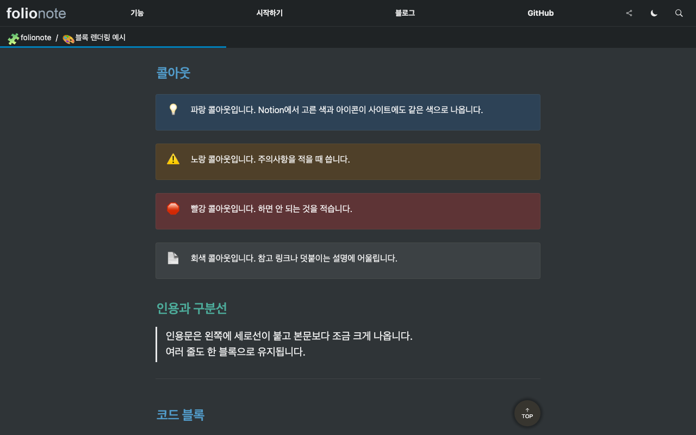

# folionote

[한국어](README.md) | **English**

folionote publishes a Notion page as a static site on a domain you own. You write in Notion, and the site is built and served from your own Vercel account under your own domain. No subscription can lapse and take the site down, and nothing stands between you and the feature you want to add. The demo at [folionote.leedo.me](https://folionote.leedo.me) is this repo deployed as-is — the demo content is in Korean.

It builds on [`nextjs-notion-starter-kit`](https://github.com/transitive-bullshit/nextjs-notion-starter-kit) and leaves rendering to [`react-notion-x`](https://github.com/NotionX/react-notion-x). The design is our own, informed by what existing services do.

<picture>
  <source media="(prefers-color-scheme: dark)" srcset="docs/images/demo-dark.png">
  
</picture>

<!-- Link the hosted version here once it exists: the easiest path -->

## Start in 5 minutes

You don't have to edit a file or clone the repo. Three steps in the browser.

1. Open the Notion page you want as your site, click Share in the top right, and turn on **Publish to web** in the Publish tab. That is a different setting from "Share link" in the same menu, and the two are easy to confuse.
2. Click the button below and enter your Notion page URL and a site name. Pasting the URL straight from the address bar works.

   [](https://vercel.com/new/clone?repository-url=https%3A%2F%2Fgithub.com%2Fnobel6018%2Ffolionote&env=NOTION_ROOT_PAGE_ID,SITE_NAME&envDescription=Your%20Notion%20page%20URL%20and%20site%20name&project-name=my-notion-site&repository-name=my-notion-site&demo-url=https%3A%2F%2Ffolionote.leedo.me)

3. That's all. From here on, edits you make in Notion reach the site within 10 minutes. If a "This Notion page is not published" screen appears right after deploying, go back to step 1 — once publishing is on, the site takes over within 30 seconds.

You need three accounts: GitHub, Vercel (the free tier is enough), and Notion.

### If you get stuck

Paste the block below into any AI assistant (ChatGPT, Claude, whichever you use) and ask.

```
I'm using folionote, an open-source project that publishes a Notion page as a website.
I got stuck partway through the steps below. Tell me what to check.

1. In the Notion page's Share -> Publish tab, turn on "Publish to web"
2. Go to https://vercel.com/new/clone?repository-url=https://github.com/nobel6018/folionote,
   connect a GitHub account, and deploy with two values: NOTION_ROOT_PAGE_ID
   (the Notion page URL) and SITE_NAME (the site name)
3. Open the deployed URL and the Notion content shows up as a site

Four common causes:
- Turning on "Share link" instead of "Publish to web". They are different settings, and
  the publish one is what matters
- NOTION_ROOT_PAGE_ID takes the whole Notion page URL. No need to extract the
  32-character ID yourself
- Edits in Notion reach the site on a 10-minute cycle. Nothing changing right away
  is normal
- A custom domain gets attached afterwards, in the Vercel project settings. Deploying
  works fine without one

Where I'm stuck: ___
```

<details>
<summary>Attaching your own domain</summary>

Add the domain under Settings → Domains in your Vercel project, and Vercel tells you which DNS records it needs. Enter those wherever you bought the domain.

| Type  | Name  | Value                  | Proxy          |
| ----- | ----- | ---------------------- | -------------- |
| A     | `@`   | `76.76.21.21`          | Off (DNS only) |
| CNAME | `www` | `cname.vercel-dns.com` | Off (DNS only) |

On Cloudflare the proxy (orange cloud) has to be off. Leave it on and Cloudflare and Vercel each try to terminate SSL, which gives you a redirect loop.

**Redeploy once after attaching the domain.** The domain is baked in at build time (`VERCEL_PROJECT_PRODUCTION_URL`), so until you redeploy, canonical URLs and share images still point at the `*.vercel.app` address.

A domain is the same product wherever you buy it, but Cloudflare Registrar sells at wholesale with no markup and charges the same for renewal as for registration. Over a few years that totals up differently from registrars that are cheap for the first year and two or three times as much after.

The full procedure, including a Route 53 example, is in [deployment](docs/deployment.md).

</details>

<details>
<summary>Changing settings from the deployed site (/admin)</summary>

Optional, and most people never need it. You write in Notion, and when a setting has to change you can edit `site.config.ts` and push. Turn this on only if you want to edit settings from a form on the live site.

It is off by default. Without the environment variables, `/admin` returns 404.

1. Register an OAuth app at <https://github.com/settings/applications/new>. The authorization callback URL is `https://<your-domain>/api/admin/auth/callback`. One character off and login is rejected.
2. Set three environment variables: `GITHUB_OAUTH_CLIENT_ID`, `GITHUB_OAUTH_CLIENT_SECRET`, and `ADMIN_SESSION_SECRET` (`openssl rand -base64 32`).
3. Environment variables are read at build time, so redeploy.

**Change your domain and you have to change the OAuth app's callback URL with it.** Login cannot work on preview deployments at all: the callback URL is one fixed value, while the preview host changes with every deploy.

How it works and the security design behind it are in [admin-deploy](docs/admin-deploy.md).

</details>

<details>
<summary>Developers: clone and modify</summary>

```bash
gh repo fork nobel6018/folionote --clone
cd folionote && pnpm install
PORT=3010 pnpm dev
pnpm test
```

Fill in `rootNotionPageId`, `name`, `domain`, and `author` in `site.config.ts` — or leave the file untouched and put just `NOTION_ROOT_PAGE_ID` and `SITE_NAME` in `.env`. When the file has a value, the file beats the environment variable.

Name the port explicitly. If 3000 is already taken, Next quietly moves to another one.

### Repo layout

It's a pnpm workspace. The root is the Next app you deploy; the renderer lives in `packages/core`.

```
/              pages/  site.config.ts  public/  next.config.js
packages/core  @folionote/core - components, config resolver, Notion read layer, CSS
```

One `pnpm install` at the root covers both. `pnpm dev` and `pnpm build` build `packages/core` before the app. While you're iterating on the package, keep `pnpm core:watch` running in a separate terminal.

For design and component changes, look at `packages/core/src/react/` and `packages/core/styles/`. [docs/architecture.md](docs/architecture.md) spells out the boundary.

If you only want the renderer inside your own app, install [`@folionote/core`](packages/core/README.md) from npm.

Using a coding agent? Open the cloned repo and tell it to deploy. [AGENTS.md](AGENTS.md) holds the setup playbook, and Claude Code also has a `/setup` slash command. Before you've cloned anything, this one-liner does it:

```
Fork and clone github.com/nobel6018/folionote, then follow the setup playbook in
AGENTS.md to deploy my Notion page <URL> under the site name <name>
```

</details>

<details>
<summary>Things worth knowing</summary>

- The Deploy button creates a copied repo, not a fork. It has no link to upstream, so updates to this repo won't reach you on their own. Fork first and import that in Vercel if you want them.
- The Vercel Hobby plan is for non-commercial use. Check the pricing if the site earns money.
- Notion data is read through the unofficial API, so changes on Notion's side can affect it.
- Edits land on a 10-minute cycle (ISR). Redeploy if you're in a hurry.
- Deploying to Cloudflare Workers isn't recommended. We moved it there and found social images (`next/og`) broken and LQIP blur previews impossible. The measurements are in [cloudflare-migration](docs/cloudflare-migration.md).

</details>

<details>
<summary>Troubleshooting</summary>

- **"This Notion page is not published" screen** - publishing is off in Notion. Turn on Publish to web in the Publish tab of the Share button and the site appears within 30 seconds.
- **Redirect loop after connecting a domain** - turn the Cloudflare proxy (orange cloud) off.
- **Edited in Notion, site unchanged** - the ISR cycle is 10 minutes. Redeploy if you can't wait.
- **`/admin` returns 404** - check that all three environment variables are present and that you redeployed after adding them. Missing even one turns it off deliberately.

More cases are in [setup-guide](docs/setup-guide.md).

</details>



Callout and heading colors picked in Notion survive dark mode. The screenshot above is the demo's [block rendering examples](https://folionote.leedo.me/examples/) page.

## Features

| Feature               | What you get                                                                                                                       |
| --------------------- | ---------------------------------------------------------------------------------------------------------------------------------- |
| Notion → static site  | Next.js SSG + ISR. Page bodies are lazily generated on first request                                                               |
| Pretty URLs           | Map paths directly, such as `/about` or `/posts/my-post`                                                                           |
| Custom domain         | Attach a domain in Vercel and add two DNS records                                                                                  |
| Dark mode             | Three states: system / dark / light. Follows the OS, and the choice persists in localStorage                                       |
| Custom color theme    | Set your own background and text colors                                                                                            |
| Top navigation        | Per-theme logo, menu links, hamburger and side drawer below 780px                                                                  |
| SEO                   | `sitemap.xml`, `feed` (RSS), and `robots.txt` generated for you. Per-page title, description, share image, and `noindex` overrides |
| Settings screen       | Form editing with a live preview at `/admin`. Writes to the file locally, commits via GitHub login on the deployed site            |
| Widgets               | Scroll progress bar, back-to-top button, popup, CTA button, mobile bottom tab bar                                                  |
| Fonts                 | Per language (ko/en/ja) plus monospace. 22 in the default list, and only the ones you pick are downloaded                          |
| Collection search     | Matches titles, tags, and dates inside a database                                                                                  |
| Share buttons         | In the header and the mobile drawer                                                                                                |
| Page view counts      | Three display styles. Needs Redis, off by default                                                                                  |
| Custom code injection | Attach analytics scripts, chat widgets, and CSS from your settings                                                                 |

An item-by-item comparison against the settings screens of commercial hosted services is in [feature-parity](docs/feature-parity.md).

## Docs

Docs below are currently Korean-only.

- [setup-guide](docs/setup-guide.md) - the whole setup procedure, the manual path, and notes on buying a domain
- [getting-started](docs/getting-started.md) - a five-step quick start
- [configuration](docs/configuration.md) - every `site.config.ts` option and the environment variable fallback rules
- [customization](docs/customization.md) - changing the look through design tokens and your own components
- [custom-code](docs/custom-code.md) - injecting scripts and CSS, per-page SEO overrides
- [deployment](docs/deployment.md) - deploying to Vercel, DNS, domain transfers, and the ISR cache strategy
- [admin-deploy](docs/admin-deploy.md) - how the deploy admin works and its security design
- [cloudflare-migration](docs/cloudflare-migration.md) - what the Workers migration measured and why we dropped it
- [feature-parity](docs/feature-parity.md) - feature comparison against commercial services
- [competitor-feature-research](docs/competitor-feature-research.md) - research on similar services
- [AGENTS.md](AGENTS.md) - the playbook and list of pitfalls for coding agents

## License

MIT - see [LICENSE](LICENSE). The MIT copyright notice from the original `nextjs-notion-starter-kit` is preserved.

## Credits

- Base project: [`nextjs-notion-starter-kit`](https://github.com/transitive-bullshit/nextjs-notion-starter-kit) by Travis Fischer
- Notion rendering: [`react-notion-x`](https://github.com/NotionX/react-notion-x)
