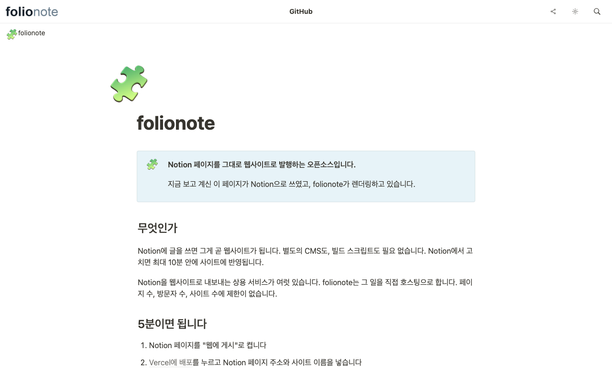

# folionote

Notion 페이지를 내 도메인의 정적 사이트로 배포하는 오픈소스입니다. 글은 Notion에서 쓰고, 발행은 내 Vercel 계정과 내 도메인에서 합니다. 구독이 끊겨 사이트가 멈추는 일도, 원하는 기능을 못 넣는 일도 없습니다. 데모는 [folionote.leedo.me](https://folionote.leedo.me)이고, 이 리포를 그대로 배포한 것입니다.

[`nextjs-notion-starter-kit`](https://github.com/transitive-bullshit/nextjs-notion-starter-kit)을 베이스로 삼고 렌더링은 [`react-notion-x`](https://github.com/NotionX/react-notion-x)에 맡깁니다. 디자인은 기존 서비스들을 참고해 자체 구현했습니다.

<picture>
  <source media="(prefers-color-scheme: dark)" srcset="docs/images/demo-dark.png">
  
</picture>

<!-- 호스팅 버전이 나오면 여기에 링크: 가장 쉬운 길 -->

## 5분 만에 시작

파일을 고치거나 리포를 클론할 필요가 없습니다. 브라우저에서 세 단계면 끝납니다.

1. Notion에서 사이트로 만들 페이지를 열고, 우상단 공유 → 게시 탭에서 **웹에 게시**를 켭니다. 같은 메뉴의 "링크 공유"와는 다른 설정이라 헷갈리기 쉽습니다.
2. 아래 버튼을 누르고 Notion 페이지 주소와 사이트 이름을 넣습니다. 주소는 브라우저에서 복사한 그대로 붙여도 됩니다.

   [](https://vercel.com/new/clone?repository-url=https%3A%2F%2Fgithub.com%2Fnobel6018%2Ffolionote&env=NOTION_ROOT_PAGE_ID,SITE_NAME&envDescription=Notion%20%ED%8E%98%EC%9D%B4%EC%A7%80%20%EC%A3%BC%EC%86%8C%EC%99%80%20%EC%82%AC%EC%9D%B4%ED%8A%B8%20%EC%9D%B4%EB%A6%84&project-name=my-notion-site&repository-name=my-notion-site&demo-url=https%3A%2F%2Ffolionote.leedo.me)

3. 끝입니다. 이후 글은 Notion에서 고치면 10분 안에 사이트에 반영됩니다. 배포 직후 "Notion 페이지가 공개되지 않았습니다" 화면이 뜨면 1번을 다시 확인하세요. 게시를 켜면 30초 안에 사이트로 바뀝니다.

준비물은 GitHub 계정, 무료로 쓸 수 있는 Vercel 계정, Notion 셋입니다.

### 막히면

아래를 아무 AI(ChatGPT, Claude 등)에 붙여 넣고 물어보세요.

```
Notion 페이지를 웹사이트로 발행하는 folionote라는 오픈소스를 쓰는 중입니다.
아래 순서를 따라가다 막혔습니다. 무엇을 확인해야 하는지 알려주세요.

1. Notion 페이지의 공유 -> 게시 탭에서 "웹에 게시"를 켠다
2. https://vercel.com/new/clone?repository-url=https://github.com/nobel6018/folionote
   에 GitHub 계정을 연결하고 NOTION_ROOT_PAGE_ID(Notion 페이지 주소)와
   SITE_NAME(사이트 이름) 두 값을 넣어 배포한다
3. 배포된 주소로 들어가면 Notion 내용이 사이트로 보인다

자주 나오는 원인 네 가지:
- "웹에 게시"가 아니라 "링크 공유"만 켠 경우. 둘은 다른 설정이고 게시 쪽을 켜야 한다
- NOTION_ROOT_PAGE_ID에는 Notion 페이지 주소를 통째로 넣어도 된다. 32자 ID를 따로 뽑을 필요 없다
- Notion에서 글을 고쳐도 사이트는 10분 주기로 갱신된다. 바로 안 바뀌는 것은 정상이다
- 도메인은 배포 후 Vercel 프로젝트 설정에서 붙이면 된다. 없어도 배포는 된다

내가 지금 막힌 단계: ___
```

<details>
<summary>내 도메인 붙이기</summary>

Vercel 프로젝트의 Settings → Domains에 도메인을 넣으면 필요한 DNS 레코드를 알려줍니다. 그 값을 도메인을 산 곳의 DNS에 넣습니다.

| 타입  | 이름  | 값                     | 프록시        |
| ----- | ----- | ---------------------- | ------------- |
| A     | `@`   | `76.76.21.21`          | 끔 (DNS only) |
| CNAME | `www` | `cname.vercel-dns.com` | 끔 (DNS only) |

Cloudflare를 쓴다면 프록시(주황 구름)를 반드시 꺼야 합니다. 켜두면 Cloudflare와 Vercel이 각각 SSL을 처리하려 들어 리다이렉트 루프가 납니다.

**도메인을 붙인 뒤 한 번 재배포하세요.** 도메인 값은 빌드 시점에 박히기 때문에(`VERCEL_PROJECT_PRODUCTION_URL`), 재배포하기 전까지 canonical URL과 공유 이미지가 `*.vercel.app` 주소를 가리킵니다.

도메인은 어디서 사도 같은 물건이지만, Cloudflare Registrar는 마진 없이 도매가로 팔고 등록가와 갱신가가 같습니다. 첫해만 싸고 둘째 해부터 두세 배를 받는 곳들과는 총액이 달라집니다.

자세한 절차와 Route 53 예시는 [deployment](docs/deployment.md)에 있습니다.

</details>

<details>
<summary>배포된 사이트에서 설정 바꾸기 (/admin)</summary>

선택 기능이고 대부분 필요 없습니다. 글은 Notion에서 쓰고, 설정을 바꿀 일이 생기면 `site.config.ts`를 고쳐 푸시하면 됩니다. 배포된 사이트에서 화면으로 고치고 싶을 때만 켭니다.

기본값은 꺼짐입니다. 환경변수를 넣지 않으면 `/admin`은 404를 돌려줍니다.

1. <https://github.com/settings/applications/new> 에서 OAuth 앱을 등록합니다. Authorization callback URL은 `https://<도메인>/api/admin/auth/callback`입니다. 한 글자만 달라도 로그인이 거부됩니다.
2. `GITHUB_OAUTH_CLIENT_ID`, `GITHUB_OAUTH_CLIENT_SECRET`, `ADMIN_SESSION_SECRET`(`openssl rand -base64 32`) 셋을 환경변수에 넣습니다.
3. 환경변수는 빌드 시점에 잡히므로 재배포합니다.

**도메인을 바꾸면 OAuth 앱의 콜백 URL도 같이 바꿔야 합니다.** 프리뷰 배포에서는 로그인이 원리적으로 안 됩니다. 콜백 URL은 하나로 고정인데 프리뷰 호스트는 배포마다 달라지기 때문입니다.

동작과 보안 설계는 [admin-deploy](docs/admin-deploy.md)에 있습니다.

</details>

<details>
<summary>개발자: 클론해서 고치기</summary>

```bash
gh repo fork nobel6018/folionote --clone
cd folionote && pnpm install
PORT=3010 pnpm dev
pnpm test
```

`site.config.ts`의 `rootNotionPageId`, `name`, `domain`, `author`를 채우거나, 파일을 그대로 두고 `.env`에 `NOTION_ROOT_PAGE_ID`와 `SITE_NAME` 두 값만 넣어도 뜹니다. 파일에 값이 있으면 파일이 환경변수를 이깁니다.

포트는 명시하는 편이 낫습니다. 3000이 이미 쓰이고 있으면 Next가 조용히 다른 포트로 옮겨 붙습니다.

코딩 에이전트를 쓴다면 클론한 리포를 열고 "배포해줘"라고 하면 됩니다. 리포의 [AGENTS.md](AGENTS.md)에 셋업 플레이북이 있고, Claude Code에서는 `/setup` 슬래시 커맨드로도 됩니다. 아직 클론하기 전이면 이 한 줄을 씁니다.

```
github.com/nobel6018/folionote 를 fork해서 클론하고, AGENTS.md의 셋업 플레이북대로
내 Notion 페이지 <URL>을 사이트 이름 <이름>으로 배포해줘
```

</details>

<details>
<summary>알아둘 것</summary>

- Deploy 버튼은 fork가 아니라 복제된 새 리포를 만듭니다. upstream과 연결이 없어서 이 리포의 업데이트가 자동으로 오지 않습니다. 업데이트를 받을 생각이면 fork한 뒤 Vercel에서 Import하세요.
- Vercel Hobby 플랜은 비상업용입니다. 수익이 붙는 사이트라면 요금제를 확인하세요.
- Notion 데이터는 비공식 API로 읽습니다. Notion 쪽 변경에 영향을 받을 수 있습니다.
- 글 수정은 10분 주기(ISR)로 반영됩니다. 급하면 재배포하세요.
- Cloudflare Workers 배포는 권하지 않습니다. 실제로 옮겨본 결과 소셜 이미지(`next/og`)가 죽고 LQIP 블러 미리보기가 불가능했습니다. 실측은 [cloudflare-migration](docs/cloudflare-migration.md) 참고.

</details>

<details>
<summary>막혔을 때</summary>

- **"Notion 페이지가 공개되지 않았습니다" 화면** - Notion 게시가 안 된 상태입니다. 공유 버튼의 게시 탭에서 웹에 게시를 켜면 30초 안에 사이트로 바뀝니다.
- **도메인 연결 후 리다이렉트 루프** - Cloudflare 프록시(주황 구름)를 끕니다.
- **Notion에서 고쳤는데 사이트에 그대로** - ISR 주기가 10분입니다. 급하면 재배포합니다.
- **`/admin`이 404** - 환경변수 셋이 다 있는지, 넣은 뒤 재배포했는지 봅니다. 하나라도 없으면 의도적으로 꺼집니다.

더 많은 사례는 [setup-guide](docs/setup-guide.md)에 있습니다.

</details>

## 기능

| 기능                 | 내용                                                                                                    |
| -------------------- | ------------------------------------------------------------------------------------------------------- |
| Notion → 정적 사이트 | Next.js SSG + ISR. 본문은 첫 요청 때 생성하는 지연 SSG                                                  |
| Pretty URL           | `/about`, `/posts/my-post` 처럼 경로를 직접 지정                                                        |
| 커스텀 도메인        | Vercel에 도메인을 붙이고 DNS 레코드 둘을 넣습니다                                                       |
| 다크모드             | system / dark / light 3-state. OS 변경을 따라가고 선택은 localStorage에 남습니다                        |
| 커스텀 색상 테마     | 배경색과 글자색을 직접 지정                                                                             |
| 상단 네비게이션      | 로고(테마별), 메뉴 링크, 780px 이하에서 햄버거 + 사이드 드로어                                          |
| SEO                  | `sitemap.xml`, `feed`(RSS), `robots.txt` 자동 생성. 페이지별 제목/설명/공유 이미지와 `noindex` 덮어쓰기 |
| 설정 화면            | `/admin`에서 폼으로 편집 + 미리보기. 로컬은 파일로 저장, 배포본은 GitHub 로그인 후 커밋                 |
| 위젯                 | 스크롤 진행률 바, 맨 위로 버튼, 팝업, CTA 버튼, 모바일 하단 탭바                                        |
| 폰트                 | 언어별(ko/en/ja) + 고정폭 지정. 기본 목록 22종, 고른 폰트만 내려받습니다                                |
| 컬렉션 검색          | 데이터베이스 안에서 제목, 태그, 날짜까지 매칭                                                           |
| 공유 버튼            | 헤더와 모바일 드로어에 노출                                                                             |
| 페이지뷰 카운트      | 표시 스타일 셋. Redis가 있어야 동작하고 기본은 꺼짐                                                     |
| 커스텀 코드 주입     | 분석 스크립트, 채팅 위젯, CSS를 설정으로 붙입니다                                                       |

상용 서비스 설정 화면과의 항목별 대조는 [feature-parity](docs/feature-parity.md)에 있습니다.

## 문서

- [setup-guide](docs/setup-guide.md) - 셋업 전체 절차. 수동 경로와 도메인 구입 참고
- [getting-started](docs/getting-started.md) - 5단계 요약 quick start
- [configuration](docs/configuration.md) - `site.config.ts` 옵션 전체와 환경변수 폴백 규칙
- [customization](docs/customization.md) - 디자인 토큰과 자체 컴포넌트로 외형 바꾸기
- [custom-code](docs/custom-code.md) - 스크립트/CSS 주입, 페이지별 SEO 덮어쓰기
- [deployment](docs/deployment.md) - Vercel 배포, DNS, 도메인 이전과 ISR 캐시 전략
- [admin-deploy](docs/admin-deploy.md) - 배포 어드민의 동작과 보안 설계
- [cloudflare-migration](docs/cloudflare-migration.md) - Workers 이전 실측과 접은 이유
- [feature-parity](docs/feature-parity.md) - 상용 서비스 기능 대조표
- [competitor-feature-research](docs/competitor-feature-research.md) - 유사 서비스 기능 조사
- [AGENTS.md](AGENTS.md) - 코딩 에이전트용 플레이북과 함정 목록

## 라이선스

MIT - [LICENSE](LICENSE) 참고. `nextjs-notion-starter-kit` 원본의 MIT 저작권 표시 보존됨.

## 크레딧

- 베이스 프로젝트: [`nextjs-notion-starter-kit`](https://github.com/transitive-bullshit/nextjs-notion-starter-kit) by Travis Fischer
- Notion 렌더링: [`react-notion-x`](https://github.com/NotionX/react-notion-x)
